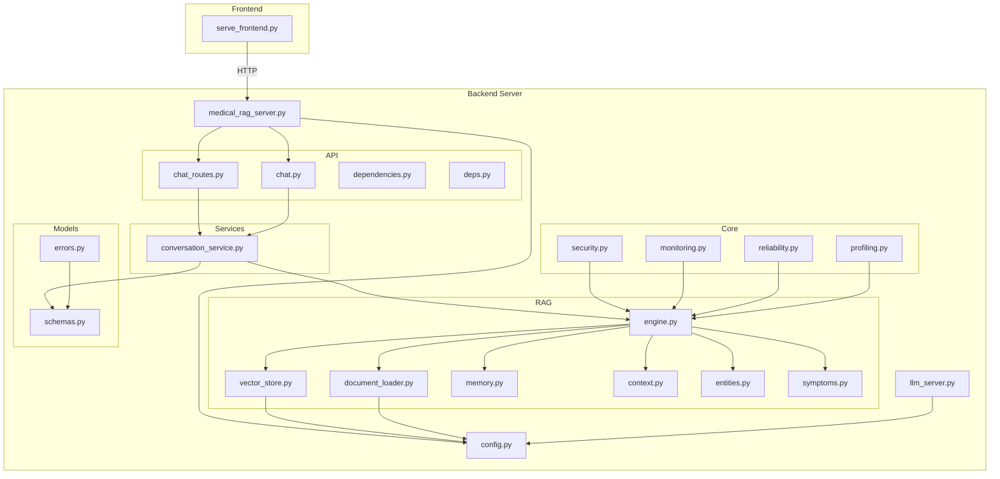

# 🏥 Medical RAG Chatbot - System Architecture

## Healthcare - Advanced Conversational AI

---

## 🎯 System Overview

The Medical RAG Chatbot is an intelligent conversational AI with memory, context awareness, and medical expertise. It acts as middleware between the frontend and LLM backend, enriching conversations with medical knowledge.

### Key Features
- **Modular Architecture** - Separate RAG, API, and core components
- **Security** - JWT/API key auth, input sanitization, medical disclaimers
- **Reliability** - Circuit breaker, health checks, error handling
- **Monitoring** - Structured logging, Prometheus metrics
- **Enhanced RAG** - ChromaDB + BM25 hybrid retrieval

---

## 🏗️ Service Architecture

```
┌─────────────────┐    ┌─────────────────┐    ┌─────────────────┐
│   Frontend      │───▶│   RAG Server    │───▶│   LLM Backend   │
│   (Port 3000)   │    │   (Port 8002)   │    │   (Port 8001)   │
└─────────────────┘    └─────────────────┘    └─────────────────┘
                              │
                        ┌─────┴─────┐
                        │ Security  │
                        │ Auth/JWT  │
                        └───────────┘
```

### Service Responsibilities

| Service | Port | Role |
|---------|------|------|
| **Frontend** | 3000 | User Interface |
| **RAG Server** | 8002 | Intelligence Layer (this project) |
| **LLM Backend** | 8001 | AI Response Generation |

---

## 🧠 Modular Architecture



```
backend/
├── api/                          # API Layer
│   ├── chat_routes.py           # All endpoints (chat, health, auth)
│   ├── dependencies.py           # Rate limiting, HTTP clients
│   └── __init__.py
│
├── rag/                          # RAG Components (modular)
│   ├── engine.py                # Main RAG coordinator
│   ├── entities.py              # Medical entity recognition (regex)
│   ├── symptoms.py              # ML symptom extraction (TF-IDF)
│   ├── memory.py                # SQLite-backed conversation memory
│   ├── context.py               # Context builder for prompts
│   ├── vector_store.py          # ChromaDB + BM25 hybrid retrieval
│   └── document_loader.py       # PDF/CSV document loading
│
├── core/                         # Core Utilities
│   ├── security.py              # JWT auth, input sanitization, disclaimers
│   ├── reliability.py           # Circuit breaker, health checks
│   ├── monitoring.py            # Structured logging, Prometheus metrics
│   └── __init__.py
│
├── config.py                    # Configuration management
└── medical_rag_server.py       # FastAPI server entry point
```

---

## 🔄 RAG Processing Pipeline

```
User Input
    │
    ▼
┌─────────────────┐
│ Input Sanitizer │ ← SQL injection & XSS protection
└────────┬────────┘
         │
         ▼
┌─────────────────┐
│ MedicalEntity   │ ← Extract symptoms, conditions, medications
│ Recognizer      │
└────────┬────────┘
         │
         ▼
┌─────────────────┐
│ SymptomExtractor│ ← TF-IDF + cosine similarity matching
└────────┬────────┘
         │
         ▼
┌─────────────────┐
│ Conversation    │ ← SQLite-backed memory
│ Memory          │
└────────┬────────┘
         │
         ▼
┌─────────────────┐
│ ContextBuilder  │ ← Build enriched prompts
└────────┬────────┘
         │
         ▼
┌─────────────────┐
│ Medical         │ ← Add disclaimer + urgent warnings
│ Disclaimer      │
└────────┬────────┘
         │
         ▼
    LLM Backend
```

---

## 🔐 Security Architecture

### Authentication Flow
```
Client → API Key/JWT → RAG Server → LLM Backend
```

### Security Components
1. **Input Sanitization** - SQL injection & XSS detection
2. **JWT Authentication** - Token-based auth with expiry
3. **API Key Support** - Optional simple auth
4. **Medical Disclaimers** - Auto-added to responses
5. **Urgent Warnings** - For high-risk symptoms

---

## 📊 Reliability Architecture

### Circuit Breaker States
```
CLOSED ──(5 failures)──> OPEN ──(30s timeout)──> HALF_OPEN ──(2 successes)──> CLOSED
```

### Health Check Components
- RAG engine status
- LLM connectivity
- Circuit breaker state
- Active sessions count

---

## 📈 Monitoring Architecture

### Metrics Collection
- HTTP requests (counter + histogram)
- Chat interactions (counter)
- LLM calls (counter + histogram)
- Active sessions (gauge)
- Cache hits (counter)

### Logging
- Structured logging with request IDs
- HTTP request/response logging
- Chat interaction logging
- LLM call tracing

---

## 🔧 Configuration

### Environment Variables

```bash
# Server
RAG_SERVER_PORT=8002
RAG_HOST=0.0.0.0

# LLM
ORIGINAL_LLM_URL=http://localhost:8001
REQUEST_TIMEOUT=30.0

# Security (optional)
REQUIRE_AUTH=false
API_KEY=your-key
JWT_SECRET=your-secret

# Rate Limiting
RATE_LIMIT_PER_MINUTE=30

# RAG
MAX_CONVERSATION_HISTORY=10
CACHE_MAX_SIZE=100
```

---

## 📡 API Endpoints

### Core Endpoints
| Method | Endpoint | Description |
|--------|----------|-------------|
| POST | `/api/v1/chat` | Chat with RAG |
| GET | `/api/v1/health` | Health check |
| GET | `/api/v1/metrics` | Prometheus metrics |

### Session Management
| Method | Endpoint | Description |
|--------|----------|-------------|
| GET | `/api/v1/conversation-history/{id}` | Get history |
| DELETE | `/api/v1/conversation/{id}` | Clear session |
| GET | `/api/v1/session-stats` | Session stats |

### Circuit Breaker
| Method | Endpoint | Description |
|--------|----------|-------------|
| GET | `/api/v1/circuit-status` | Get status |
| POST | `/api/v1/circuit-reset` | Reset |

### Authentication
| Method | Endpoint | Description |
|--------|----------|-------------|
| POST | `/api/v1/auth/token` | Get JWT token |

---

## 🚀 Deployment

### Quick Start
```bash
# Install dependencies
pip install -r requirements.txt

# Configure environment
cp .env.example .env
# Edit .env with your settings

# Start server
cd backend
python medical_rag_server.py

# Access API docs
# http://localhost:8002/docs
```

---

## 📊 Version History

### v1.1.0 (Current)
- Modular codebase (rag/, api/, core/)
- JWT authentication
- Pydantic request validation
- Circuit breaker
- Prometheus metrics
- Hybrid retrieval (ChromaDB + BM25)

### v1.0.0
- Core RAG engine
- Medical entity recognition
- Conversation memory

---

**🏥 Medical RAG Chatbot System**  
*Transforming Medical Conversations with AI Intelligence*